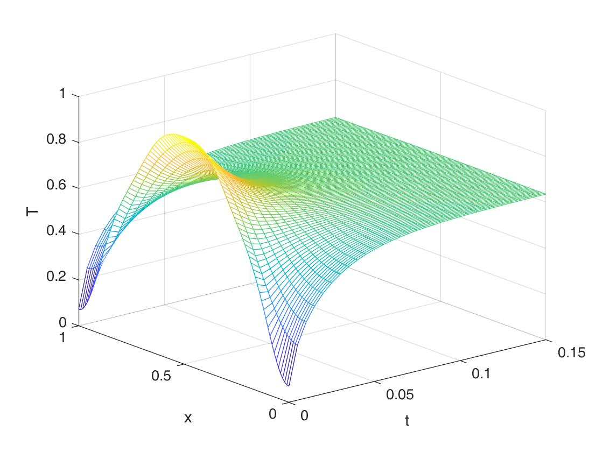
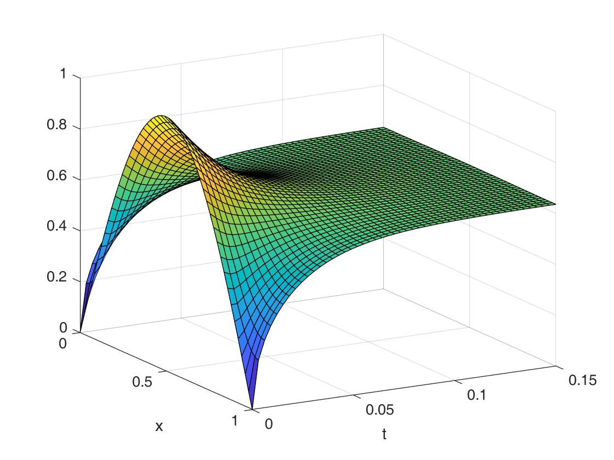
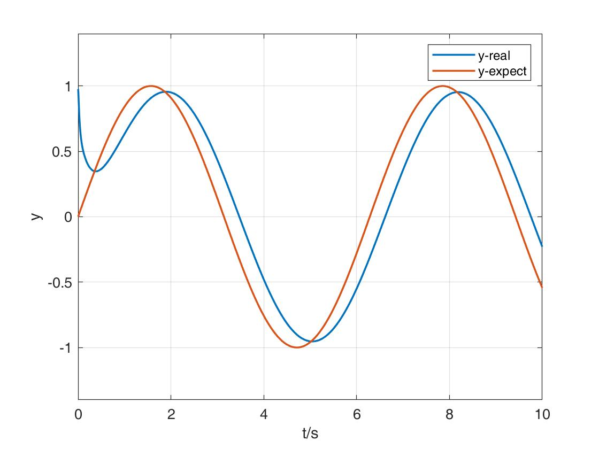
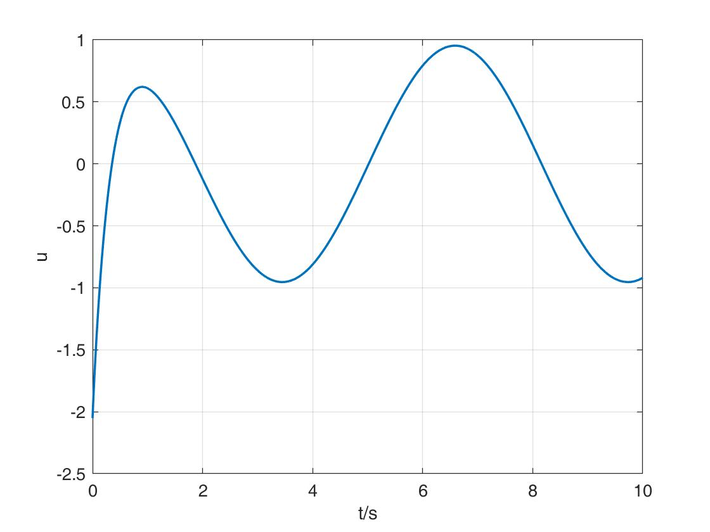

## 第十周作业

高钰满，3170105242

### 题目描述

热方程：
$$
\left\{
\begin{array}{**lr**}

\frac{\partial T}{\partial t}=\frac{\partial }{\partial x}\cdot (a^2\cdot \frac{\partial T}{\partial x})&0\lt x\lt L,t\gt 0\\

T(x,0)=\Phi(x)\\

\frac{\partial T}{\partial x}|_{x=0}=\frac{\partial T}{\partial x}|_{x=L}=0

\end{array}
\right.
$$


1. 现已知$a=1$，初始条件$\Phi(x)=sin\frac{\pi x}{L}$，将上述热方程展开前10项：$T(x,t)=\sum\limits_{0}^{10}X_n(x)T_n(t)$;

   并利用展开的10项画出$T(x,t)$的三维图像(三轴分别为$T,t,x$)

   

2. 用MATLAB函数`pdepe`求解热方程，将结果与第一问对比

   

3. LQ无限时长跟踪问题：将上述热方程展开前5项作为近似，将温度作为输出量$y(t)=T(L,t)$，自选$y_r(t)$作为跟踪目标，设计反馈控制。


#### EX1

对温度函数$T(x,t)$做分离变量：
$$
T(x,t) = X(x)T(t)
$$
代入热方程得：
$$
\frac{\ddot{X}(x)}{X(x)} = \frac{\dot{T}(t)}{a^2T(t)}=\lambda
$$

$$
\ddot{X}(x)=\lambda X(x)\\
\dot{T}(t)=\lambda a^2T(t)
$$

---

首先求解$X(x)$，这是一个本征值问题：
$$
\left\{
\begin{array}{**lr**}
\ddot{X}(x)=\lambda X(x)\\
\dot{X}(0)=0\\
\dot{X}(L)=0\\
\end{array}
\right.
$$
对$\lambda$做分类讨论，当$\lambda \gt 0$时，$X(x)=0$；

当$\lambda \le 0$时，
$$
X_n(x)=A_ncos(\frac{n\pi}{L})\\
\lambda_n=-(\frac{n\pi}{L})^2
$$

----

再求解 $\dot{T}(t)=\lambda a^2T(t)$：
$$
T_n(t)=C_n \cdot exp(-a^2\cdot (\frac{n\pi}{L})^2t)
$$
代入得：
$$
T(x,t)=C_0+\sum^\infty_{n=1}C_n \cdot exp(-a^2\cdot (\frac{n\pi}{L})^2t)\cdot cos\frac{n\pi x}{L}
$$

---

现求解其中的系数$C_n$：

由$T(x,0)=\Phi(x)$，将$t=0$代入$T(x,t)$，得：
$$
\Phi(x)=\sum^\infty_{n=0}C_n\cdot cos(\frac{n\pi x}{L})
$$
将$\{1, cos(\frac{\pi x}{L}), cos(\frac{2\pi x}{L}),...,cos(\frac{n\pi x}{L})\}$看作基，做如下内积：
$$
<\Phi(x),cos(\frac{n\pi x}{L})>=C_n\cdot <cos(\frac{n\pi x}{L}),cos(\frac{n\pi x}{L})>\\
\int^L_0\Phi(x)cos(\frac{n\pi x}{L})dx=C_n\cdot \int^L_0\cos^2(\frac{n\pi x}{L})
$$
得到：
$$
C_0=\int^L_0\Phi(x)dx\\C_n=\frac{2}{L}\int^L_0\Phi(x)cos(\frac{n\pi x}{L})dx,n\gt0
$$

---

综上所述，上述**热方程的解**为：
$$
T(x,t)=C_0+\sum^\infty_{n=1}C_n \cdot exp(-a^2\cdot (\frac{n\pi}{L})^2t)\cdot cos\frac{n\pi x}{L}
$$
其中，$C_0=\int^L_0\Phi(x)dx\\C_n=\frac{2}{L}\int^L_0\Phi(x)cos(\frac{n\pi x}{L})dx,n\gt0$.


按照题目要求取$T(x,t)$的前10项作为其近似，画出$(T,x,t)$三维的温度分布：




### EX2

利用MATLAB中的`pdepe`函数求解该热方程：

（完整代码见`ex2.m`）

```matlab
sol = pdepe(m, @pdex1pde, @pdex1ic, @pdex1bc, x, t);

function [c,f,s] = pdex1pde(x,t,T,DTDx) % PDE方程
    c=1;
    f=DTDx;
    s=0;
end

function T0 = pdex1ic(x) % 初始条件
    global L;
    T0 = sin(pi*x/L);
end

function [pl,ql,pr,qr] = pdex1bc(xl,Tl,xr,Tr,t) % 边界条件
    pl = 0;
    ql = 1;
    pr = 0;
    qr = 1;
end
```

`pdepe`函数`@pdex1pde`格式：
$$
c\left(x, t, u, \frac{\partial u}{\partial x}\right) \frac{\partial u}{\partial t}=x^{-m} \frac{\partial}{\partial x}\left(x^{m} f\left(x, t, u, \frac{\partial u}{\partial x}\right)\right)+s\left(x, t, u, \frac{\partial u}{\partial x}\right)
$$
`@pdex1bc`格式：
$$
p(x, t, u)+q(x, t) f\left(x, t, u, \frac{\partial u}{\partial x}\right)=0
$$
求解图像如下：




### EX3

现考虑加入控制项：
$$
\left\{
\begin{array}{**lr**}

\frac{\partial T}{\partial t}=\frac{\partial }{\partial x}\cdot (a^2\cdot \frac{\partial T}{\partial x})+g(x)u(t)&0\lt x\lt L,t\gt 0\\

T(x,0)=\Phi(x)\\

\frac{\partial T}{\partial x}|_{x=0}=\frac{\partial T}{\partial x}|_{x=L}=0

\end{array}
\right.
$$
其中，选择$g(x)=\delta(x-0.8L)$，此处的冲激函数表示的意义是**点温度控制**，通过在$0.8L$处的热源控制目标点温度.

期望控制$L/2$处的温度为$y_r(t)=sin(x)$.


考虑将前5项作为$T(x,t)$的近似：
$$
T(x,t) = \sum_{n=0}^{4}X_n(x)T_n(t)
$$
其中，$X_n=\{1, cos(\frac{\pi x}{L}), cos(\frac{2\pi x}{L}),cos(\frac{3\pi x}{L}),cos(\frac{4\pi x}{L})\};T_n$待求.


#### 构造系统状态空间模型

取齐次解的基：
$$
X_m=\{1, cos(\frac{\pi x}{L}), cos(\frac{2\pi x}{L}),cos(\frac{3\pi x}{L}),cos(\frac{4\pi x}{L})\}
$$
将式子$\frac{\partial T}{\partial t}=\frac{\partial }{\partial x}\cdot (a^2\cdot \frac{\partial T}{\partial x})+g(x)u(t)$分别**对基的每一维$x_m\in X_m$做内积**（即x在0-L上积分）
$$
\int^L_0\frac{\partial T}{\partial t}\cdot x_m(x)dx=\int^L_0\frac{\partial }{\partial x}\cdot (a^2\cdot \frac{\partial T}{\partial x})\cdot x_m(x)dx+\int^L_0g(x)u(t)\cdot x_m(x)dx
$$
化简得：
$$
\int^L_0\frac{\partial T}{\partial t}\cdot x_m(x)dx=-a^2\int^L_0\frac{\partial T}{\partial x}\cdot \dot{x}_m(x)dx+\int^L_0g(x)u(t)\cdot x_m(x)dx
$$
---

代入$T(x,t)$的5项近似，左式第一项为：
$$
\int^L_0\frac{\partial T}{\partial t}\cdot x_m(x)dx=\sum^{4}_0\int^L_0x_n(x)\cdot x_m(x)dx\cdot \dot{T}(t)
\begin{equation}
    \overset{\Delta}{=}
\end{equation}
\sum^{4}_0P_{mn}\cdot \dot{T}(t)
$$
右式第一项为：
$$
-a^2\int^L_0\frac{\partial T}{\partial x}\cdot \dot{x}_m(x)dx=-a^2\sum^{4}_0\int^L_0\dot{x_n}(x)\cdot \dot{x_m}(x)dx\cdot T(t)
\begin{equation}
    \overset{\Delta}{=}
\end{equation}
-a^2\sum^{4}_0Q_{mn}\cdot T(t)
$$
右边第二项定义为：
$$
\int^L_0g(x)\cdot x_m(x)dx\cdot u(t)\begin{equation}
    \overset{\Delta}{=}
\end{equation}
R_{m}\cdot u(t)
$$
式子整体化为：
$$
\sum^{4}_0P_{mn}\cdot \dot{T}(t)=-a^2\sum^{4}_0Q_{mn}\cdot T(t)+R_{m}\cdot u(t)
$$

---

进一步化简有：
$$
\dot{T}(t)=AT(t)+Bu(t)\\
y(t)=T(L/2,t)=CT(t)=\begin{bmatrix}x_0(L/2),...,x_4(L/2)\end{bmatrix}\cdot 

\begin{bmatrix} T_0(t)\\...\\T_4(t) \end{bmatrix}
$$
其中，$A=-P^{-1}Q,B=P^{-1}R$

$P$为$5\times 5$矩阵，各元素$P_{mn}=\int^L_0 x_n(x) x_m(x)dx$

$Q$为$5\times 5$矩阵，各元素$Q_{mn}=\int^L_0 \dot{x}_n(x) \dot{x}_m(x)dx$

$R$为$5\times 1$矩阵，各元素$R_{m}=\int^L_0 g(x) x_m(x)dx$


#### 设计无限时长跟踪器

误差为$e(t)=y(t)-y_r(t)$.

二阶性能指标为：
$$
J=\frac{1}{2} \int_{0}^{t_{f}}\left[q e^{2}(t)+r u^{2}(t)\right] \mathrm{d} t
$$
最优控制为：
$$
u(t)= - R^{-1}B^T(PT(t)-g)
$$
其中$P$满足代数$Riccati$方程：
$$
-P A-A^{T} P+P B R^{-1} B^{T} P-C^{T} Q C=0
$$
$g(t)$关系式：
$$
\boldsymbol{g}=\left[P B \boldsymbol{R}^{-1} \boldsymbol{B}^{T}-\boldsymbol{A}^{T}\right]^{-1} \boldsymbol{C}^{T} \boldsymbol{Q} y_{r}
$$


跟踪$L/2$处温度为$y_r(t)=sin(x)$的结果如下：

$L/2$处温度：



$0.8L $处的点温度控制：



至此，实现了通过$0.8L $处的点温度控制，使$L/2$处温度能够跟踪期望温度：$y_r(t)=sin(x)$.